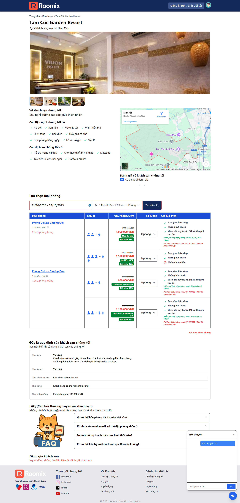
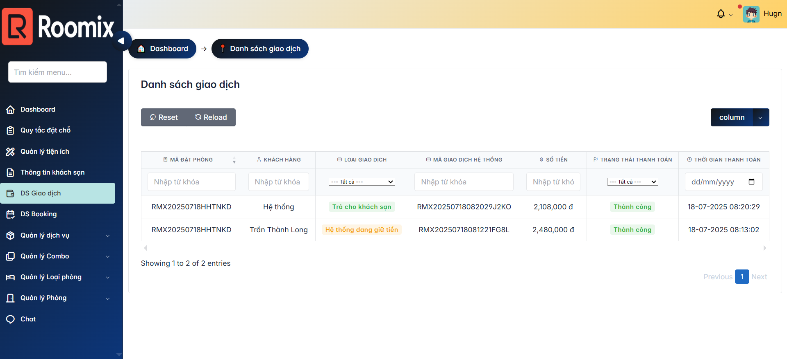
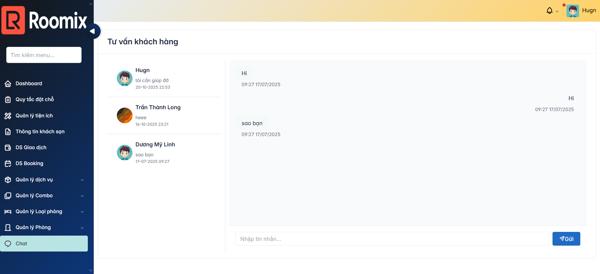
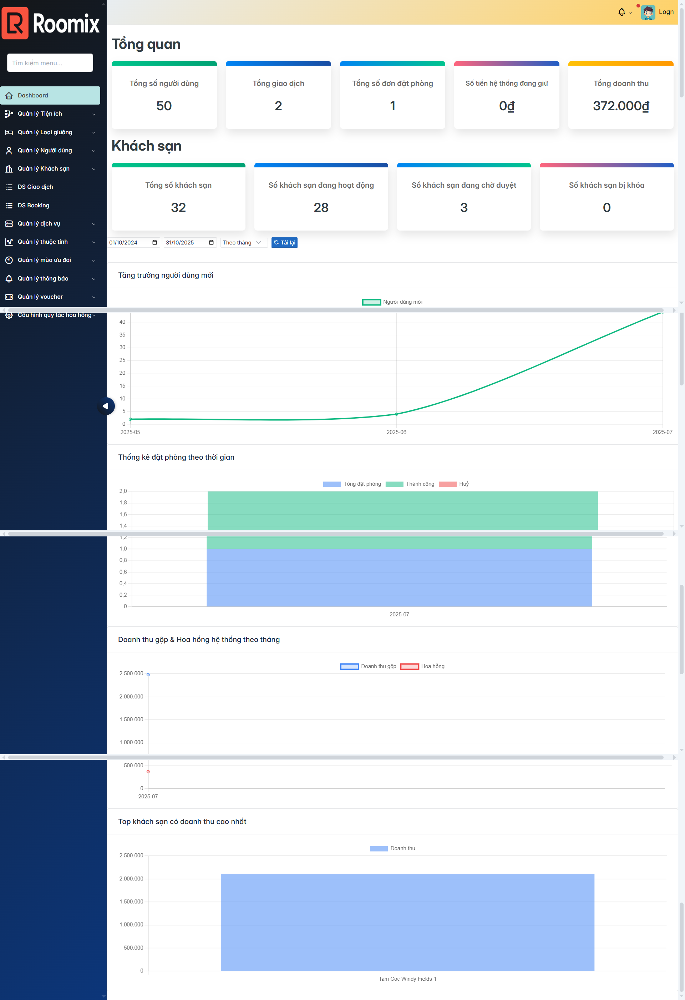
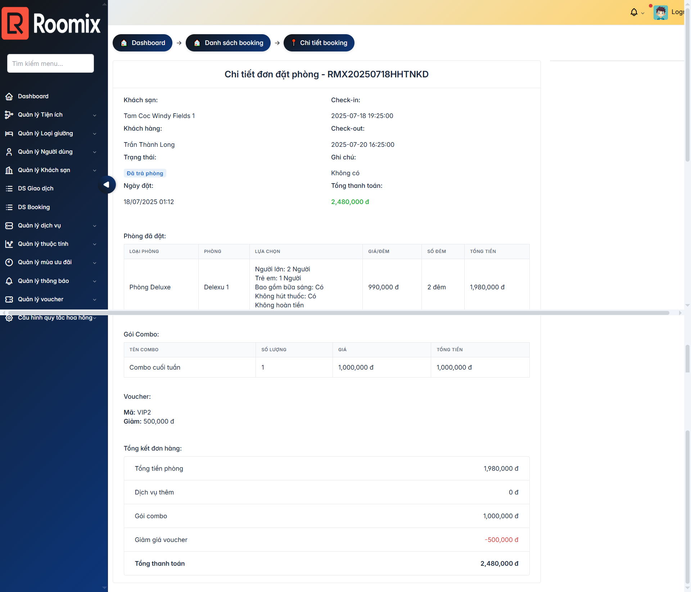

# ĐỒ ÁN TỐT NGHIỆP: ROOMIX - HỆ THỐNG ĐẶT PHÒNG KHÁCH SẠN

Sinh viên thực hiện:  
Bùi Bảo Lâm  
Trần Thành Long

---

## Giới thiệu dự án

Roomix là nền tảng đặt phòng khách sạn trực tuyến, đóng vai trò trung gian kết nối khách hàng, chủ khách sạn và quản trị viên.  
Hệ thống được xây dựng với Laravel (Backend + CMS + API), ReactJS (Frontend), hỗ trợ giao tiếp thời gian thực qua WebSocket Reverb và vận hành trên HTTPS với Nginx.

---

## Vai trò người dùng

- **Khách hàng:** Tìm kiếm, đặt phòng và tương tác với chủ khách sạn.  
- **Chủ khách sạn:** Quản lý khách sạn, phòng và dịch vụ, theo dõi các đặt phòng.  
- **Quản trị viên (CMS):** Quản lý toàn bộ hệ thống, người dùng và nội dung.

---

## Công nghệ sử dụng

- Backend: Laravel 10, PHP 8.2, MySQL  
- Frontend: ReactJS, Vite  
- Realtime: Laravel Reverb WebSocket  
- Server & SSL: Nginx, Certbot (HTTPS)  
- Quản lý gói: Composer, Yarn  

---

## Giao diện


Frontend (Khách hàng):  



CMS - Chủ khách sạn:  



CMS - Quản trị viên:  



---

## Triển khai nhanh

### Backend
```bash
git clone https://github.com/TellYaHeadliner/Graduation-Project.git
cd backend
npm install
composer install
cp .env.example .env
php artisan key:generate
php artisan migrate --seed
npm run build 

# Chạy server Laravel
php artisan serve

# Chạy Reverb WebSocket (terminal khác)
php artisan reverb:start

# Chạy Queue Worker (terminal khác)
php artisan queue:work

cd frontend
yarn install
yarn dev

